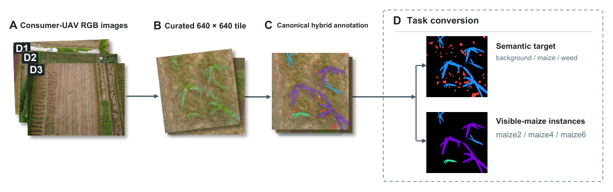

# MaizeMask v1.0

Training and evaluation code for the MaizeMask v1.0 paper. The repository
contains the exact five model families, paper hyperparameters, evaluation
metrics, pinned dependencies, and patched Detectron2/Mask2Former source needed
to reproduce the reported protocol.



*Project overview. MaizeMask turns curated UAV RGB field tiles into two
complementary outputs: a semantic maize/weed map and visible-maize instances
for stage-aware analysis.*

The dataset is retained by the authors and is not distributed through GitHub.
The local `dataset/maizemask_v1.0_public_release/` directory is ignored by
Git. Authorized reviewers and research users can set a path to their supplied
MaizeMask v1.0 release when preparing the split tree below. See
[`dataset/README.md`](dataset/README.md) for the required local layout.

## Dataset at a glance

| Item | MaizeMask v1.0 |
|---|---|
| Acquisition | Consumer-UAV RGB field imagery |
| Curated data | 332 anonymized 640 x 640 PNG tiles from three maize fields |
| Labels | 12,890 COCO segmentation annotations |
| Semantic task | Background / maize / weed cover |
| Instance task | Visible maize instances in appearance groups `maize2`, `maize4`, `maize6` |
| Ambiguity policy | `maize-u` contributes to semantic maize but is ignored for stage-specific instance evaluation |
| Primary evaluation | Three-fold leave-one-field-out (LOSO) |
| Secondary evaluation | Spatially guarded fixed train/validation/test split |
| Access | Data available from the authors to authorized reviewers and research users |

Weed annotations represent observed cover regions rather than individual weed
plants. The maize appearance groups are not biological V-stages. MaizeMask is
an application-oriented UAV RGB benchmark for hybrid segmentation; it does not
claim field-validated spraying or geographic/multi-season generalization.

## Requirements

The reference environment was Python 3.12.3, PyTorch 2.8.0+cu128,
Torchvision 0.23.0+cu128, CUDA toolkit 12.8 and a CUDA-capable GPU. `nvcc` is
required because Detectron2 and Mask2Former compile custom CUDA extensions.

The repository is tested with the package versions in `requirements.txt` and
the immutable model/weight provenance in `environment.lock.json`. Results can
vary slightly across GPU drivers and hardware.

## Train the complete paper protocol

```bash
git clone https://github.com/truongho581/maize-mask-uav.git maizemask
cd maizemask

# Recommended: isolate the exact paper dependencies.
python3.12 -m venv .venv
source .venv/bin/activate

# Installs the pinned PyTorch/cu128 stack and remaining dependencies,
# then builds the two required CUDA extensions.
bash scripts/install.sh

# Download the three pinned pretrained inputs and verify SHA-256 hashes.
python scripts/prepare_pretrained_weights.py --cache-root .cache

# Create the loader-compatible split tree from an authorized data release.
python scripts/prepare_data_splits.py \
  --release-root /path/to/maizemask_v1.0_release \
  --output-root .runtime_data

# Run every paper configuration at 50 epochs.
python scripts/train_paper.py \
  --dataset-root .runtime_data/loso \
  --cache-root .cache \
  --output-root results/paper_run
```

`train_paper.py` executes the complete protocol directly—there is no one-epoch
validation matrix in this public repository. It runs 42 training
configurations:

- Attention U-Net, DeepLabV3+-ResNet-50 and scratch SegFormer-B0: three seeds
  (`42`, `123`, `3407`) across three LOSO folds;
- pretrained SegFormer-B0: the same three seeds and three folds;
- COCO-pretrained Mask R-CNN R50-FPN and Mask2Former R50: seed `42` across
  three folds;
- 50 epochs per configuration, 640 × 640 input and batch size 2.

It then runs three additional Mask2Former checkpoint-reload evaluations (one
per fold). Thus the log contains 45 processes, but only 42 of them train.

The runner writes every command, log, checkpoint and the final
`paper_training_report.json` under the chosen output directory. Training is
deliberately not resumed or skipped automatically, so a result directory is
unambiguous evidence for one invocation.

## Paper hyperparameters

| Model family | Initialization | Optimizer settings | Other settings |
|---|---|---|---|
| Attention U-Net | scratch | lr 1e-3, weight decay 0 | cosine schedule, stable-hash augmentation |
| DeepLabV3+-R50 | scratch | lr 1e-3, weight decay 0 | cosine schedule, `--drop-last-train` for BatchNorm |
| SegFormer-B0 | scratch | lr 1e-3, weight decay 0 | cosine schedule, stable-hash augmentation |
| SegFormer-B0 | pinned MiT-B0 ImageNet-1K encoder | lr 6e-5, weight decay 1e-2 | cosine schedule, stable-hash augmentation |
| Mask R-CNN R50-FPN | pinned Torchvision COCO | lr 5e-4, weight decay 1e-4 | cosine schedule, horizontal flip |
| Mask2Former R50 | pinned official COCO instance model | lr 1e-4, weight decay 5e-2 | horizontal flip; best-checkpoint test evaluation |

The exact commands are encoded in `scripts/train_paper.py`. The three trainers
also support direct use when a single model/fold/seed is wanted:

```text
experiments/training_scripts/training/train_semantic_loso.py
experiments/training_scripts/training/train_maskrcnn_loso.py
experiments/training_scripts/training/train_mask2former_r50_loso.py
```

Each trainer evaluates its selected checkpoint on the test partition and
writes metrics automatically. Standalone checkpoint evaluation and result
aggregation utilities are in `experiments/training_scripts/evaluation/`.

## Repository layout

```text
scripts/       environment setup, data preparation, pretrained weights, full training
src/           dataset loaders, architectures, losses and metrics
experiments/   train/evaluation entry points
third_party/   pinned, patched Detectron2 and Mask2Former source
assets/        README overview figure
dataset/       tracked placement instructions; authorized data are ignored by Git
```

Mask2Former is pinned to commit `9b0651c6c1d5b3af2e6da0589b719c514ec0d69a`
and Detectron2 to `a2f4a8771ab77e8411c26b27f24f9489a28a2453`. Their licenses
are retained in `third_party/`; upstream documentation and CI files are not
needed for installation or training and are intentionally excluded.

## License

The MaizeMask code is released under the [MIT License](LICENSE). The dataset
is not distributed with this repository and remains subject to the authors'
data-access process. Vendored third-party components retain their own licenses.
